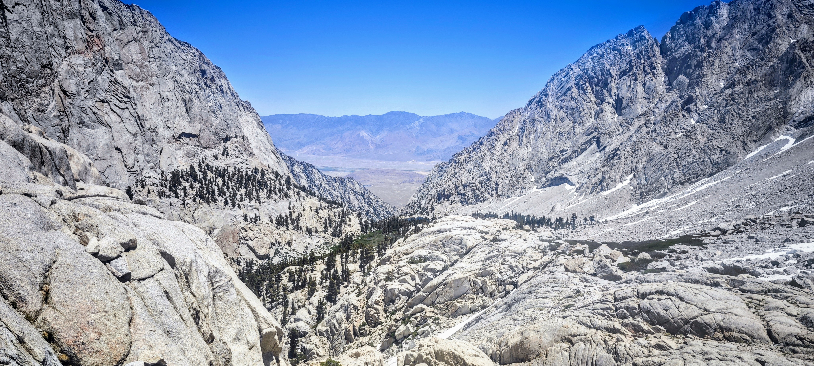

```{r setup, include=FALSE,highlight=TRUE, background='#F7F7F7'}
library(tufte)
# invalidate cache when the tufte version changes
knitr::opts_chunk$set(cache.extra = packageVersion('tufte'))
options(htmltools.dir.version = FALSE)
```

For 12 June 2025, the alarm on the phone was set for 11:29 PM (yes, PM for a wake up!), but I was already awake since 9 PM, heart racing with anticipation. By 12:58 AM, 11 of us^[We were split into two groups at the start as previously had planned. Half of us began the ascend an hour early, but we would eventually catch up before arriving at the trail camp] and as many headlamps cut through the crisp mountain air as we began our ascent from Whitney Portal, embarking on what would become one of the most memorable alpine adventures of our lives.

```{r figGate, fig.margin = TRUE, fig.width= 8, fig.height= 8, fig.cap = "At the Whitney portal, this iconic wooden gate structure is the one every hiker will pass through. They also have a weighing machine to calibrate your backpack situation.", message=TRUE, cache=TRUE, echo=FALSE, out.width='100%'}

```

## Into the Night


```{r figWall, fig.margin = TRUE, fig.width= 8, fig.height= 8, fig.cap = "This was my first stunning moment of joy on the trail. A picture like this often hung on the walls of barber shops of yore in villages of Kerala, back in the 1980s. So many poems and songs flashed through my mind seeing this. Arundhati Roy's [Aymanam](https://www.keralatourism.org/destination/aymanam/617/) from [The God of Small Things](https://en.wikipedia.org/wiki/The_God_of_Small_Things) as well. She would have penned something like this seeing this, I thought: *Waters that whispered secrets to the night, silvered by a moon that had forgotten how to sleep.* If you watched the Malayalam movie song [Indulekha Kanthurannu](https://youtu.be/udzpQ39ldFA?si=XeuJun3BZbAXgd4S&t=124) from Oru Vadakkan VeeraGadha, the setting was much like this above. It was simply spectacular.  *ആരുടെ മായാമോഹമായ് ആരുടെ രാഗഭാവമായ് ആയിരം വർ‌ണ്ണരാജികളിൽ ഗാനമുണർത്തും ശ്രുതി മുഴങങി..*", message=TRUE, cache=TRUE, echo=FALSE, out.width='100%'}
knitr::include_graphics("images/waterfall1.jpg")
```

Starting a Mt. Whitney^[Mount Whitney is the highest point in the contiguous U.S. at 14494 feet (4418 meters) above sea level and represents the Sierra Nevada's greatest summit. It is named after geologist [Josiah Whitney](https://en.wikipedia.org/wiki/Josiah_Whitney), the very same name sake of Whitney glacier] day hike in the depths of night transforms the entire experience. The world becomes intimate and vast simultaneously. Your circle of light reveals only the immediate trail ahead while the towering presence of the Sierra Nevada looms invisibly around you. Each step forward is an act of faith, trusting the switchbacks that wind steadily upward through the darkness. I had done some hikes in the dark before, but nothing like this early and certainly not to this scale! So this was a first of a kind. 

The night sky above was spectacular. The Milky Way wasn't visible as such to the naked eye, but I am sure it stretched across the heavens. Countless stars sparkled with an intensity that made our headlamps seem almost unnecessary. The moon was amazing and full, yet the stars were plentiful. There's something profoundly humbling about hiking beneath such a canopy. It puts your own journey into perspective while simultaneously making you feel part of something infinitely larger.

About two miles into our ascent, still shrouded in darkness with only our headlamps cutting through the pre dawn air, we began to hear the first signs of the Sierra's lifeblood. The sound of water gushing through the darkness. Even though the trail remained well marked and visible under our lights, these auditory hints of rushing water added a new dimension to our night journey, promising the water crossings that lay ahead.

By around 2 AM, we encountered our first stream crossings, and they felt absolutely magical. After hours of steady climbing in the dry mountain air, the sound and sight of crystal clear Sierra snowmelt rushing over granite was incredibly refreshing. Each water crossing became a small celebration. A chance to refill bottles, splash cool water on our faces, but that early hours of the day not really. But we could listen to the melodic symphony of mountain streams that would accompany us throughout our climb. The famous romantic lines by [Pablo Neruda](https://en.wikipedia.org/wiki/Pablo_Neruda) came to my mind:

> *I will bring you happy flowers from the mountains, bluebells, dark hazels, and rustic baskets of kisses. I want to do with you what spring does with the cherry trees.*
>
> — Pablo Neruda

The numerous water crossings throughout the early stages of the trail became one of the unexpected highlights of our night ascent. There's something deeply satisfying about the sound of rushing water in the wilderness (People who knows me well, will know how much I love the waters). It's both energizing and calming, providing a constant reminder that we were moving through a living, dynamic ecosystem even in the darkness.


```{r figFull, fig.fullwidth=TRUE,fig.margin = FALSE, fig.cap = "The granite cathedral of the Sierra Nevada, showing off.", message=TRUE, cache=TRUE, echo=FALSE, out.width='100%'}

```


```{r figSunriseWeb, fig.margin = TRUE, fig.width= 8, fig.height= 8, fig.cap = "An image sourced from [Brad Spiess](https://www.ihikesandiego.com/about-me/). I had always wished to witness and perhaps even capture an image such as this one by [Brad Spiess](https://www.ihikesandiego.com/about-me/). You can see this image [The whitney sunrise from the trail camp near the iceberg lake](https://www.ihikesandiego.com/wp-content/uploads/2013/10/Sunrise-at-Trail-Camp-small.jpg) and also read his fantastic blog here. We were touch late to get there by then.", message=TRUE, cache=TRUE, echo=FALSE, out.width='100%'}

```


As we gained elevation, the moonlight began revealing the magnificent pine trees that define this section of the Sierra Nevada. While these trees weren't the massive giants I'd encountered in other forests, they possessed their own grand presence. Tall, stately conifers that seemed to stand as silent sentinels along our path. Some reached impressive heights, their massive trunks disappearing into the darkness above our lights, creating a cathedral like atmosphere as we wound our way between them. These towering trees created an almost mystical quality to the early stages of our climb, making each turn of the trail a small revelation. I did see some fallen trees and that instantly reminded me my favorite Keane hit ["Somewhere Only We Know"](https://www.youtube.com/watch?v=Oextk-If8HQ) album.

## Reaching Base Camp


```{r figWhitneyViewFromLake, fig.margin = TRUE, fig.width= 10, fig.height= 8, fig.cap = "Immediateley after the sunrise, the daylight came flashing hard and all of a sudden the granite giants stood firm and bright.", message=TRUE, cache=TRUE, echo=FALSE, out.width='100%'}
knitr::include_graphics("images/whitney_view.jpg")
```


After nearly six hours of steady climbing through the pre dawn darkness, we reached the base camp at 7 AM. The two hours leading upto was a unique spectacle staged on a vast arena of the mountain passage. The eastern sky was beginning to blush with the first hints of sunrise, gradually revealing the magnificent landscape that had been hidden in darkness during our ascent. I will never forget that experience.


```{r figDawn, fig.fullwidth=TRUE,fig.margin = FALSE, fig.width= 8, fig.height= 8, fig.cap = "At dawn the light arrived like a whispered promise, spilling secrets of gold.", message=TRUE, cache=TRUE, echo=FALSE, out.width='100%'}

```

```{r figSnowmelt, fig.margin = TRUE, fig.width= 8, fig.height= 8, fig.cap = "The warming snow turned into small streams that divided naturally around obstacles. Each stream broke into smaller branches, creating a simple pattern of flowing water that sparkled in the morning light.", message=TRUE, cache=TRUE, echo=FALSE, out.width='100%'}

```


```{r figSunrise, fig.margin = FALSE, fig.width= 8, fig.height= 8, fig.cap = "How could the sun possibly contain his joy at seeing us down here? He simply had to come out soon and play!", message=TRUE, cache=TRUE, echo=FALSE, out.width='100%'}

```


We spent two hours at base camp, partly to rest and refuel, but mostly to soak in the incredible scenery that daylight had unveiled. The granite peaks surrounding us caught the early morning light, transforming from shadowy silhouettes into gleaming monuments of stone. Waterfalls cascaded down distant cliffs, golden lights flashed for a few seconds, but once arrived on the stage, sun was srong and intense. Did the mountain creeks sing their eternal songs as snow melt found its way downhill? Perhaps!


```{r figFullWhitney, fig.fullwidth=TRUE,fig.margin = FALSE, fig.cap = "The sun kissed the Whitney peaks, and they blushed rose for a second", message=TRUE, cache=TRUE, echo=FALSE, out.width='100%'}

```

```{r figIcyPath, fig.margin = TRUE, fig.width= 8, fig.height= 8, fig.cap = "Icy patches are on the trails even before the trail camp. This one was a pretty handy long one somewhere 2 miles before the trail camp.", message=TRUE, cache=TRUE, echo=FALSE, out.width='100%'}

```

At this point, we had two choices. We could take the hard chute. This route was dangerous. We would need to climb straight up using ice axes. Our other option was the regular trail. This trail goes up through 99 switchbacks. Usually this climb is straightforward but tiring. However, ice made it dangerous that day. We had to think carefully about each step. Frozen patches on the trail made things worse. The conditions were not good. Some people in our group tried this regular route.


```{r figSky2, fig.margin = TRUE, fig.width= 8, fig.height= 8, fig.cap = "The heavens continue to hold high, so does the moonlit granite", message=TRUE, cache=TRUE, echo=FALSE, out.width='100%'}

```

```{r figWoodPath, fig.margin = FALSE, fig.width= 8, fig.height= 8, fig.cap = "Seeing the few wooden crossings on the trail, and after witnessing many streams, mountains and timber, I was thinking about Neruda's words: **'I grew up in this town, my poetry was born between the hill and the river, it took its voice from the rain, and like the timber, it steeped itself in the forests.'**", message=TRUE, cache=TRUE, echo=FALSE, out.width='100%'}

```

```{r figLakefromAbove, fig.margin = TRUE, fig.width= 8, fig.height= 8, fig.cap = "Emerald lake from above (taken from the switch back trails before the cable section).", message=TRUE, cache=TRUE, echo=FALSE, out.width='100%'}

```

```{r figChuteClimb, fig.margin = TRUE, fig.width= 8, fig.height= 8, fig.cap = "Some brave men attempting the chute climb.", message=TRUE, cache=TRUE, echo=FALSE, out.width='100%'}

```


```{r figCable, fig.margin = TRUE, fig.width= 8, fig.height= 8, fig.cap = "The cable section on the 99 switch back route had quite of snow to be dealt with.", message=TRUE, cache=TRUE, echo=FALSE, out.width='100%'}

```


```{r figViewBack, fig.margin = TRUE, fig.width= 8, fig.height= 8, fig.cap = "View of the [Owens valley](https://en.wikipedia.org/wiki/Owens_Valley) and Lone Pike valley", message=TRUE, cache=TRUE, echo=FALSE, out.width='100%'}

```


The majority of our team attempted the 99 switchback route, and four of us decided to attempt the chute. A more direct but significantly more technical route covered by ice to the summit. The chute represents the classic mountaineering challenge that Mt. Whitney can offer, requiring both physical endurance and technical skill.

The first team went all the way to the cable section and decided to return after assessing the snow situation. The other team (where yours truly was) made it halfway up the chute before wisdom overcame ambition. The ice conditions, which had been merely sketchy lower down, were becoming genuinely dangerous. As the morning sun began to warm the slopes, the ice started turning slushy, and our crampons (adequate for the hard conditions we'd encountered earlier) were no longer providing the reliable grip we needed for safe passage. Once we realized that we wouldnt be able to summit before noon, we made the difficult decision to stop ascending further. 

## Personal Battles

For me personally, this adventure came with an additional challenge that served as a stark reminder of how important proper preparation is for high altitude endeavors. On the night before our departure from San Diego, I'd played 3 hours of tennis. A decision that seemed harmless at the time but would later contribute to my fatigue. With only four hours of sleep, I found myself driving from San Diego to Lone Pine at 4 AM on the 12th, already running on fumes.


Our plan to acclimatize at Mt. Whitney Portal that afternoon seemed sound in theory. We arrived and attempted to rest at 3:30 PM, hoping to catch up on some much needed sleep before our midnight start. But mountain rest rarely goes according to plan. I managed to sleep until 6:30 PM, but from then on, it was patchy at best. Brief moments of dozing interrupted by the anticipation of the climb ahead and the unfamiliar sounds of the mountain environment.

By the time we left the hotel at 12:30 AM for the 30 minute drive to the portal, I was running on minimal sleep spread across nearly 48 hours. When our hike officially began at 1 AM, I was physically prepared and in good shape, but mentally I was already fighting an uphill battle against exhaustion.

The sleep deprivation didn't fully hit me during the initial ascent. The excitement and adrenaline of the pre dawn climb kept me moving steadily upward. But by the time I reached midway to the chute, the cumulative effect of the sleepless nights was catching up with me. My usual mountain confidence was being undermined by a fog of fatigue, while at the chute.

Fortunately, I didn't experience any altitude sickness or other altitude related symptoms. My body was handling the elevation well, and physically I felt strong. But the mental fatigue was undeniable, and it became another factor in our decision calculus. In mountaineering, being honest about your condition (both physical and mental) is crucial for safety.


The decision to turn back wasn't made lightly. We were tantalizingly close to our goal, and the summit of Mt. Whitney seemed almost within reach. But mountain safety isn't just about reaching the top. It's about making it back down safely. The combination of deteriorating ice conditions, the time constraints of a day hike, and my own sleep deprived state made the choice clear, even if it wasn't easy.

As the ice became increasingly slushy, we realized our equipment wasn't adequate for the changing conditions. Perhaps aggressive crampons could have helped. Either starting even earlier to complete the climb while conditions remained firm, or planning for an overnight approach that would allow us to tackle the technical sections during the optimal early morning hours.

## The True Summit

While we didn't reach Whitney's 14,505 foot peak that day, we experienced something equally valuable. The alpine environment revealed itself in all its glory as we made our descent. Snow covered peaks, views of lakes and the warming valleys below, birds calls echoing off the granite walls. Every tree, every rock formation, every distant peak appeared stunning. Mountain creeks, swollen with snow melt, created a constant soundtrack of rushing water. Nature's own symphony accompanying our journey.

## Lessons from the Mountain

Our Mt. Whitney attempt taught us valuable lessons about mountain climbing and, perhaps more importantly, about knowing when to be content with what you've achieved rather than pushing for what you think you should achieve. The mountains have their own timeline, their own conditions, and their own rules. Respecting these isn't a sign of failure. It's a sign of wisdom and experience.

```{r figMarmot, fig.margin = TRUE, fig.width= 8, fig.height= 8, fig.cap = "At the rail camp site, there were a handful of marmots. Here you can see one of this clever rodent sneaking in and out of a tent, likely sensing some dining opportunity!", message=TRUE, cache=TRUE, echo=FALSE, out.width='100%'}

```

The pre dawn start had given us something precious. Those hours of solitude in one of America's most spectacular wilderness areas. We'd witnessed the transition from night to day, watched the mountains wake up, and experienced the unique magic that comes with being in the high country when the rest of the world is still asleep.


## The Alpine Experience

What struck us most profoundly was the completeness of the alpine experience. It wasn't just about reaching a summit or covering a certain distance. It was about immersing ourselves in an environment that exists on its own terms. The night sky, the sound of our footsteps on the frozen trail, the gradual revelation of the landscape as dawn broke, the technical challenge of the ice conditions, the wildlife, the countless small moments of beauty and wonder. All of these combined to create something far more meaningful than simply touching a summit marker.

The waterfalls we glimpsed in the early morning light, the birds we watched soaring between the peaks, the incredible silence that exists only in the high mountains. These are the memories that will stay with us long after the physical effort has been forgotten.


```{r figFullLonePikeLake, fig.fullwidth=TRUE,fig.margin = FALSE, fig.cap = "Lone Pike lake.", message=TRUE, cache=TRUE, echo=FALSE, out.width='100%'}
knitr::include_graphics("images/lonepike.jpg")
```


## Planning Your Own Adventure


```{r figIcyWater, fig.margin = TRUE, fig.width= 8, fig.height= 8, fig.cap = "Water streams behind icy plates", message=TRUE, cache=TRUE, echo=FALSE, out.width='100%'}
knitr::include_graphics("images/icy.jpg")
```

For those considering their own Mt. Whitney adventure, our experience offers several takeaways. Starting in the pre dawn hours isn't just about beating crowds or heat. It's about experiencing the mountain in a completely different way. The night sky alone makes the early start worthwhile.

However, ice conditions can change rapidly, and what seems manageable at 2 AM might become dangerous by 10 AM. Having the right equipment for the conditions you'll actually encounter, not just the conditions you expect, is crucial. More importantly, having the flexibility to change your plans based on what the mountain gives you is perhaps the most valuable skill any mountaineer can develop.


```{r figStreams, fig.margin = TRUE, fig.width= 8, fig.height= 8, fig.cap = "Pretty stream", message=TRUE, cache=TRUE, echo=FALSE, out.width='100%'}

```


```{r figPortalWaterfall1, fig.margin = FALSE, fig.width= 8, fig.height= 8, fig.cap = "The Whitney Portal features a beautiful stream that alone makes the location worth visiting. The area offers excellent amenities including campgrounds, a picnic area, and a fishing pond alongside this scenic waterway. The portal also has a store that sells souvenirs and food. The store is famous for serving enormous pancakes at breakfast. We enjoyed their sandwiches and chips for lunch, while enjoying the company of some blue birds, squirrels and some french Canadian motor riders chatting behind.", message=TRUE, cache=TRUE, echo=FALSE, out.width='100%'}

```


```{r figFall0, fig.margin = TRUE, fig.width= 8, fig.height= 8, fig.cap = "No shortage of waterfalls. ", message=TRUE, cache=TRUE, echo=FALSE, out.width='100%'}

```


## The Descent

The descent presented its own unique set of challenges and rewards. What had been a manageable climb in the cool pre dawn darkness became a test of endurance under the full exposure of the high altitude sun. With minimal shade available on the exposed granite slopes, the sun's intensity at elevation was relentless. Each step downward felt like walking through a furnace.

The contrast was striking. We'd begun our journey bundled in layers against the mountain cold, and now we were stripping down to base layers, desperately seeking any pocket of shade the terrain might offer. Hydration became critical, but, grateful for every mountain stream we encountered along the way.

The sleep deprivation that had plagued me earlier finally caught up during the descent, but fortunately, the mountain provided its own remedy. Near the cascading waterfalls and rushing creeks, I managed to steal a couple of short power naps. There's something almost meditative about the sound of water gushing over granite. The constant, rhythmic flow created a natural white noise that seemed to wash away the fatigue and stress of the challenging climb. These brief rest stops became unexpected highlights of the descent, offering both physical recovery and a moment of zen like tranquility in the wilderness.

```{r figBlueBird, fig.margin = TRUE, fig.width= 8, fig.height= 8, fig.cap = "Plenty of Steller's Jay birds showing of their beauty all around. This one was quite friendly at the Whitney portal area.", message=TRUE, cache=TRUE, echo=FALSE, out.width='100%'}

```


```{r figFlower, fig.margin = FALSE, fig.width= 8, fig.height= 8, fig.cap = "വിടർന്നൂ മരുഭൂവിൻ എരിവെയിലിലും പൂക്കൾ, Flowers bloomed even in the scorching sun of the desert. Even in this heat, there was music in the air, there were the occasional flowers and ofcourse plenty of hope. The Malayalam script is from this famous song from [Moonampakkam](https://www.youtube.com/watch?v=KX7dikJQA4w)", message=TRUE, cache=TRUE, echo=FALSE, out.width='100%'}

```


```{r figBlueBird2, fig.margin = TRUE, fig.width= 8, fig.height= 8, fig.cap = "Now he says he looks best from this side. I oblige!", message=TRUE, cache=TRUE, echo=FALSE, out.width='100%'}

```


But the challenging descent also revealed some of the most spectacular scenery of our entire adventure. Mirror Lake appeared incredibly clear and pristine. We didn't have the chance to explore it fully, but even from our vantage point, we could see why it earned its name. 


Dramatic was our encounter with Consultation Lake higher up on our route. This lake was a testament to winter's lingering grip on the high Sierra, with its surface partially frozen in fascinating patterns. The ice stretched across portions of the lake's surface. Some areas clear, others clouded with trapped air bubbles and snow, while open water remained visible in other sections. This partially frozen surface created an otherworldly landscape, like walking past a giant natural ice rink suspended thousands of feet above sea level, where winter and spring were locked in their eternal dance.

This June and is technically beginning of summer. It looked as though spring was still asserting itself in some areas while winter held firm in others, creating a dynamic landscape that seemed to change with every turn of the trail.


## Friendship

Perhaps the most unexpected and rewarding aspect of this Mt. Whitney adventure was the camaraderie that developed among our hiking group. What began as a shared goal to summit California's highest peak evolved into something far more valuable. Genuine friendships forged in this process.


```{r figGateend, fig.margin = TRUE, fig.width= 8, fig.height= 8, fig.cap = "Trail gate finally. We started the ascend through this pretty gate in the dark and returned through the very same gate at dusk.", message=TRUE, cache=TRUE, echo=FALSE, out.width='100%'}

```

Our group had been preparing for this moment for months, with most of the team dedicating nearly every weekend to long ascents over the past six months. While I managed to join them for only a few of these training hikes (San Gorgonio and a couple of El Cajon mountain climbs), those shared preparation experiences had already begun building the foundation of trust and friendship that would prove invaluable on Whitney.

The magic of mountain friendships lies in their intensity and authenticity. When you're sharing the challenges of a pre dawn start, navigating icy conditions together, and making crucial safety decisions as a group, pretense falls away quickly. Our conversations ranged from serious discussions about route conditions to lighthearted gossip that had us laughing despite our exhaustion. The shared moments of wonder (pointing out particularly spectacular views, capturing photos of each other against the dramatic Sierra backdrop, and even engaging in the kind of harmless pranks that make tough miles pass more quickly) created bonds that extended far beyond the trail.

There's something about the mountain environment that strips away the superficial layers of social interaction. When you're tired, cold, and pushing your limits, you see people as they really are. Our group supported each other through the challenging sections, shared food and water freely, and celebrated small victories together. The marmot encounter at base camp had us all laughing and sharing stories, while the difficult decision to turn back from the chute was made collectively, with everyone's input valued and respected.


```{r figFar, fig.margin = TRUE, fig.width= 8, fig.height= 8, fig.cap = "You cant see me off that easily, so says Mt Whitney", message=TRUE, cache=TRUE, echo=FALSE, out.width='100%'}

```

The photography sessions along the way became particularly memorable. Not just for documenting our adventure, but for the spontaneous moments of joy they captured. Whether it was someone striking a dramatic pose against the granite backdrop or candid shots of us trudging through the snow covered switchbacks, these images would later serve as tangible reminders of the fun we had together despite the challenging conditions.

By the time we were making our sun baked descent, tired but triumphant in our own way, we knew that the real summit we'd achieved wasn't measured in elevation gained. We'd built something that would outlast any temporary physical accomplishment. Friendships rooted in shared challenge, mutual support, and the kind of authentic experiences that only the mountains can provide.


## The Real Victory

Despite the punishing sun exposure during our descent, tired but exhilarated, we realized that we'd achieved something significant. We'd pushed our limits, experienced one of California's most spectacular wilderness areas in ideal conditions, and made smart decisions when conditions changed. We'd witnessed sunrise from 12,000 feet, navigated technical terrain safely, and gained invaluable experience for future adventures.


Mt. Whitney will still be there for our next attempt. The summit isn't going anywhere. But the experience we had (the complete alpine adventure, the night sky, the challenging conditions, the wildlife, the incredible scenery, and the lessons learned) is something we'll carry with us forever.

Sometimes the mountain gives you the summit. Sometimes it gives you something even better: a perfect day in the high country, a deeper understanding of your own capabilities and limitations, and memories that will inspire future adventures. On this particular day, Mt. Whitney gave us exactly what we needed, even if it wasn't exactly what we'd planned.


# Disclaimer

If you haven't figured it out yet, the proofreading of this was done using a local tool developed with [Ollama](https://ollama.com). I thought it did a pretty decent job fixing the grammar (although I had to run another round of manual proofreading to avoid a few meandering issues). This is still a work in progress.

The article itself is written in R Markdown. All photos (unless explicitly mentioned otherwise) are taken by myself or my hiking buddies, **The Trail Blazers**. For typesetting, I have used the Tufte handout style format (thanks to [Edward Tufte](https://en.wikipedia.org/wiki/Edward_Tufte)), which reads best when viewed on a computer or, if on a phone/tablet, when the device is held horizontally.

```{r bib, include=FALSE}
# create a bib file for the R packages used in this document
knitr::write_bib(c('base', 'rmarkdown'), file = 'skeleton.bib')
```